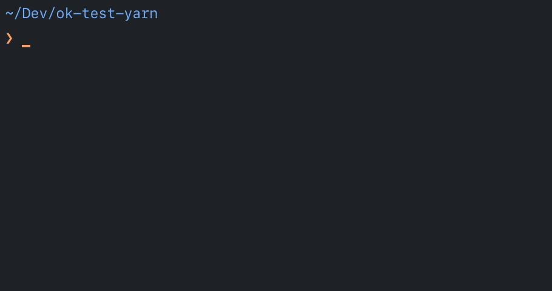

# ok

> 🙇‍♂️ An obliging task runner

Run `npm-scripts` in the correct environment without further installation or config.



## Install 

<a href="https://npmjs.org/package/@sndrs/ok" title="View this project on NPM"></a>

```bash
$ yarn global add @sndrs/ok
```
or
```bash
$ npm install -g @sndrs/ok
```

### Follows project conventions

-   [x] fetch and use correct node version, observing:
    -   [x] `.nvmrc`
    -   [x] `engines`
-   [x] use project package manager (`yarn` or `npm`)
    -   [x] use the checked in yarn version if present
    -   [ ] use `engines` npm if present
-   [x] always run tasks with up-to-date dependencies

### No dependencies

-   [x] `yarn` does not need to be installed
-   [x] no `nvm`/`n` etc needed

### Change host env as little as possible

-   [x] no changes to `$PATH`
-   [x] do not change the system Node
-   [x] do not install node versions if unnecessary
-   [x] do not affect NVM

### Experience

-   [x] Notify when using out-of-date version
-   [x] All user task output should be shown – no magic
-   [ ] All available scripts in current context discoverable by running without args (`ok`)

#### Maybe...

-   [ ] Use local version if available?
-   [ ] enable `ok.config.js`?
-   [ ] discover `make` targets?

## See also

-   [`nvexeca`](https://github.com/ehmicky/nvexeca): `nvm` + `execa`
